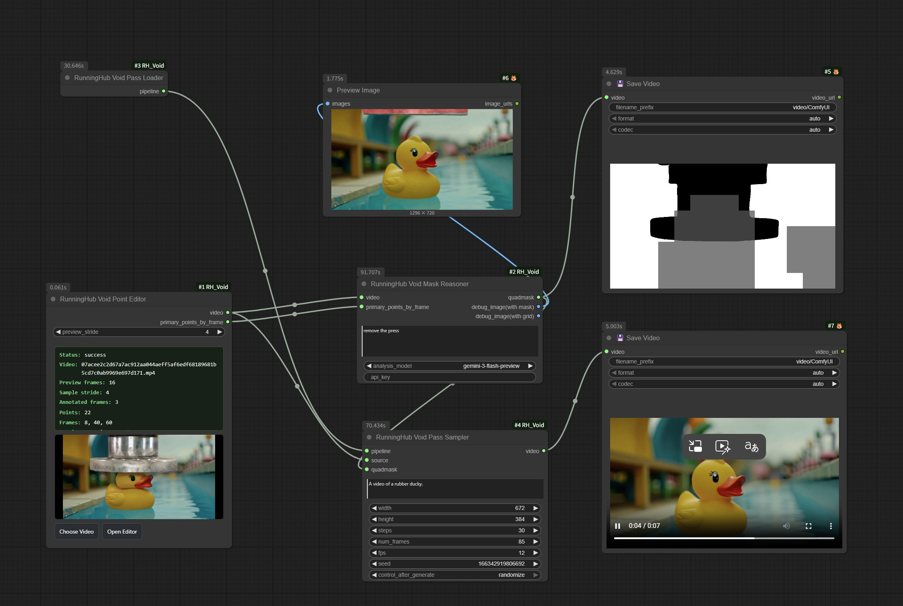
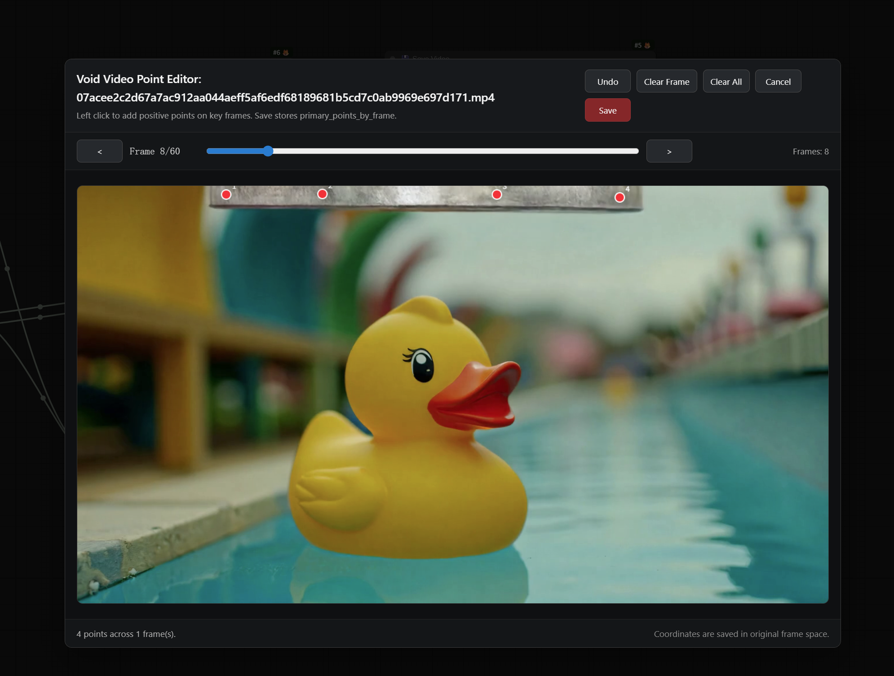
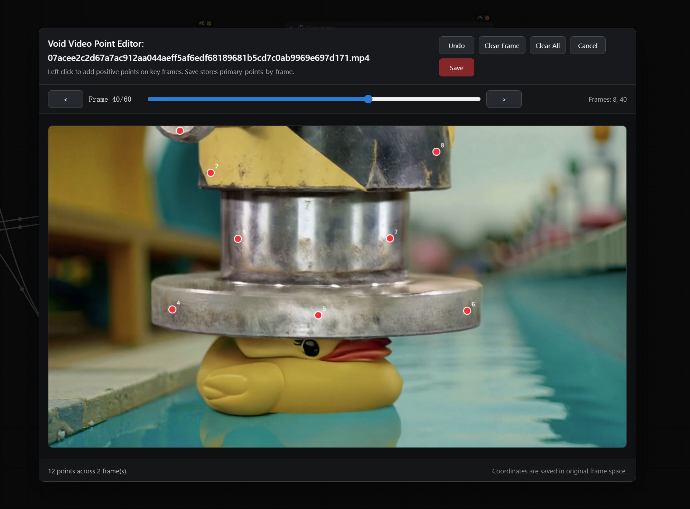
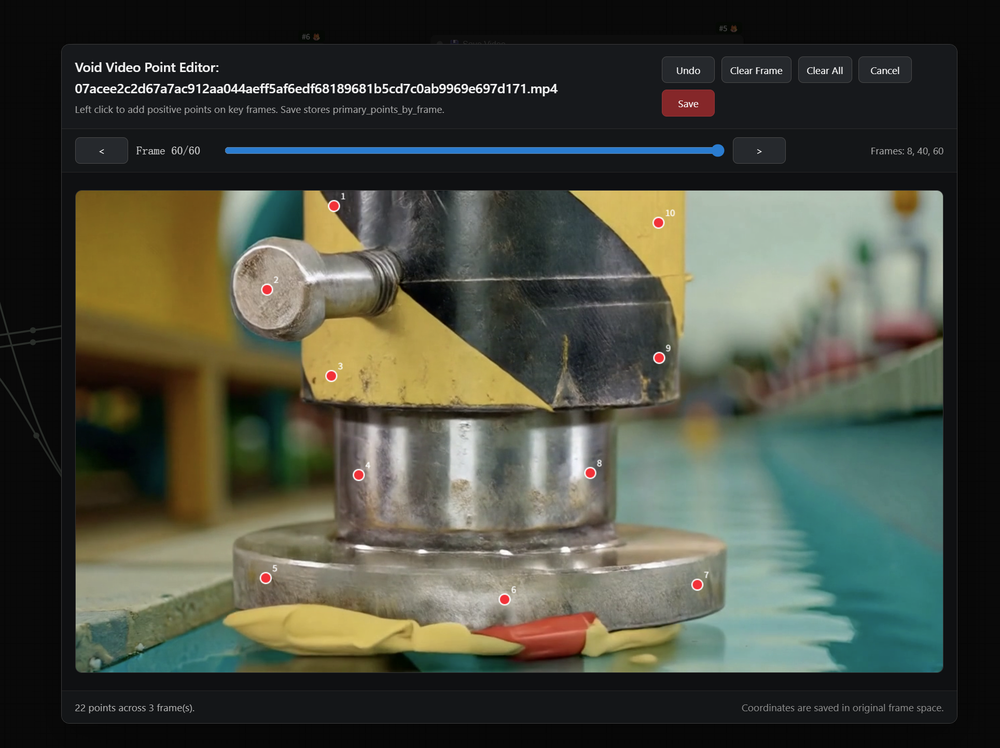

<div align="center">

# ComfyUI_RH_Void

</div>

<div style="line-height: 1;">
  <a href="https://www.runninghub.cn/" target="_blank" style="margin: 2px;">
    
  </a>
  <a href="https://github.com/Netflix/void-model" target="_blank" style="margin: 2px;">
    
  </a>
  <a href="https://arxiv.org/abs/2604.02296" target="_blank" style="margin: 2px;">
    
  </a>
  <a href="https://huggingface.co/netflix/void-model" target="_blank" style="margin: 2px;">
    
  </a>
</div>

<hr>

`ComfyUI_RH_Void` 是 [VOID: Video Object and Interaction Deletion](https://github.com/Netflix/void-model) 的 ComfyUI 插件项目，用于在 ComfyUI 中删除视频中的目标物体，以及它们对场景产生的交互影响。这不仅包括阴影、反射等次级视觉影响，也包括人物或物体被移除后引起的接触、支撑、推动等物理交互变化。

该插件将 VOID 的核心推理流程整理为 ComfyUI 节点工作流，支持在 ComfyUI 中完成：

- 视频上传与关键帧点选
- 主体物体分割
- 受影响区域分析与 quadmask 生成
- 基于 VOID Pass 1 的视频修复生成

> **Example:** 如果删除一个正在拿着吉他的人，插件不仅会尝试删除这个人本身，也会尽量删除这个人对吉他的影响，使吉他在结果中呈现更自然的下落或状态变化。

---

## 🤖 Models

当前这个 ComfyUI 插件工作流会使用以下模型和资源：

| Model | Source |
|-------|--------|
| **SAM2 2.1 Hiera Large** | [Download](https://dl.fbaipublicfiles.com/segment_anything_2/072824/sam2.1_hiera_large.pt) |
| **SAM3** | [facebook/sam3](https://huggingface.co/facebook/sam3) |
| **CogVideoX-Fun-V1.5-5b-InP** | [alibaba-pai/CogVideoX-Fun-V1.5-5b-InP](https://huggingface.co/alibaba-pai/CogVideoX-Fun-V1.5-5b-InP) |
| **VOID Pass 1** | [Download](https://huggingface.co/netflix/void-model/blob/main/void_pass1.safetensors) |

当前插件版主要封装的是 **VOID Pass 1** 推理链路。原始仓库中的 `void_pass2.safetensors` 属于 Pass 2 refined inference，当前节点工作流未接入，因此不是必需模型。

---

## ▶️ Quick Start

将本项目放到 ComfyUI 自定义节点目录：

```bash
ComfyUI/custom_nodes/ComfyUI_RH_Void
```

重启 ComfyUI 后即可加载节点。

最直接的使用方式是在 ComfyUI 中加载本仓库附带的示例工作流：

- `example/void_example.json`



推荐的节点顺序如下：

1. `RunningHub Void Point Editor`
2. `RunningHub Void Mask Reasoner`
3. `RunningHub Void Pass Loader`
4. `RunningHub Void Pass Sampler`
5. `SaveVideo`

示例工作流中的默认设置包括：

- `Mask Reasoner` prompt: `remove the press`
- `analysis_model`: `gemini-3-flash-preview`
- `Pass Sampler` prompt: `A video of a rubber ducky.`

> [!IMPORTANT]
>
> 当前开源版本使用 `gemini-3-flash-preview` 或 `gemini-3-pro-preview` 模型进行 Stage 2 分析处理，需要在 Google 官方 [Google AI Studio](https://aistudio.google.com/apikey) 申请 `api_key`。
>
> 如果你希望免配置 `api_key`，也可以直接在我们的线上平台 [RunningHub](https://www.runninghub.cn/) 使用平台内置模型完成分析。

### Node Guide

#### `RunningHub Void Point Editor`

用途：

- 上传输入视频
- 按 `preview_stride` 抽帧预览，可通过调整其大小来决定编辑器中看到视频的抽帧密度
- 在编辑器中点选要移除的主体对象

使用建议：

- 不需要每一帧都点，通常点首次出现、最后出现和中间关键帧即可
- 如果目标被遮挡、消失后再次出现，建议在重新出现的帧补点
- 尽量沿目标边缘点选，不要只点在中心





输出：

- `video`
- `primary_points_by_frame`

#### `RunningHub Void Mask Reasoner`

用途：

- 生成最终 `quadmask`
- 生成 `debug_image(with mask)` 及 `debug_image(with grid)`用于调试

主要输入：

- `video`
- `primary_points_by_frame`
- `prompt`：写要移除什么，例如 `remove the press`
- `analysis_model`：`gemini-3-flash-preview` 模型免费，需要申请Google Gemini API key使用
- `api_key`

输出：

- `quadmask`
- `debug_image(with mask)`
- `debug_image(with grid)`

调试建议：

- 红色区域不对，通常说明点选位置不够贴边
- 黑色区域中间闪烁，通常说明关键帧点选不足
- 灰色区域不对，通常说明 Stage 2 分析结果不理想

#### `RunningHub Void Pass Loader`

用途：

- 加载 `CogVideoX-Fun-V1.5-5b-InP`
- 加载 `void_pass1.safetensors`
- 输出可供采样节点使用的 VOID pipeline

输出：

- `pipeline`

#### `RunningHub Void Pass Sampler`

用途：

- 输入原视频、`quadmask` 和背景 prompt
- 使用 VOID Pass 1 生成修复结果视频

主要输入：

- `pipeline`
- `source`
- `quadmask`
- `prompt`：写移除目标后希望保留或生成的背景描述，例如 `A video of a rubber ducky.`

推荐初始参数：

- `width=672`
- `height=384`
- `steps=30`
- `num_frames=85`
- `fps=12`

最终将输出视频连接到 `SaveVideo` 保存即可。

---

## 📁 Expected directory structure

建议把模型按以下结构放置：

```text
ComfyUI/
├── custom_nodes/
│   └── ComfyUI_RH_Void/
│       ├── README.md
│       ├── nodes.py
│       ├── passv2v.py
│       ├── example/
│       │   └── void_example.json.json
│       ├── vlm_mask/
│       └── ...
└── models/
    ├── sam2/
    │   └── sam2.1_hiera_large.pt
    ├── sam3/
    │   ├── sam3.pt
    │   └── bpe_simple_vocab_16e6.txt.gz
    ├── diffusers/
    │   └── CogVideoX-Fun-V1.5-5b-InP/
    │       ├── scheduler/
    │       ├── text_encoder/
    │       ├── tokenizer/
    │       ├── transformer/
    │       └── vae/
    └── void-model/
        └── void_pass1.safetensors
```

当前代码默认查找的关键路径如下：

- `ComfyUI/models/sam2/sam2.1_hiera_large.pt`
- `ComfyUI/models/sam3/sam3.pt`
- `ComfyUI/models/sam3/bpe_simple_vocab_16e6.txt.gz`
- `ComfyUI/models/diffusers/CogVideoX-Fun-V1.5-5b-InP`
- `ComfyUI/models/void-model/void_pass1.safetensors`

---

## ✍️ Prompt Guide

这个插件里有两类 prompt，作用不同：

### Mask Reasoner prompt

写“要移除什么”：

```text
remove the press
remove the rubber ducky
remove the person
```

### Pass Sampler prompt

写“移除后画面应是什么样”：

```text
A video of a rubber ducky.
A ball rolls off the table.
Two pillows placed on the table.
```

不要重复描述“删除动作”，而应该描述删除后剩余的背景和场景状态。

---

## 🙏 Acknowledgements

This ComfyUI plugin is built for the VOID project and uses models or code derived from the following works:

- [Netflix/void-model](https://github.com/Netflix/void-model)
- [aigc-apps/CogVideoX-Fun](https://github.com/aigc-apps/CogVideoX-Fun/tree/main)
- [facebookresearch/segment-anything-2](https://github.com/facebookresearch/segment-anything-2)
- [facebookresearch/sam3](https://github.com/facebookresearch/sam3)

We also thank the authors of the projects acknowledged in the original VOID repository, including:

- [Gen-Omnimatte](https://github.com/gen-omnimatte/gen-omnimatte-public/tree/main)
- [Go-with-the-Flow](https://github.com/Eyeline-Labs/Go-with-the-Flow)
- [Kubric](https://github.com/google-research/kubric)
- [HUMOTO](https://jiaxin-lu.github.io/humoto/)

---

## 📄 Citation

If you find VOID useful, please consider citing the original paper:

🔗 https://arxiv.org/abs/2604.02296

```bibtex
@misc{motamed2026void,
  title={VOID: Video Object and Interaction Deletion},
  author={Saman Motamed and William Harvey and Benjamin Klein and Luc Van Gool and Zhuoning Yuan and Ta-Ying Cheng},
  year={2026},
  eprint={2604.02296},
  archivePrefix={arXiv},
  primaryClass={cs.CV},
  url={https://arxiv.org/abs/2604.02296}
}
```
